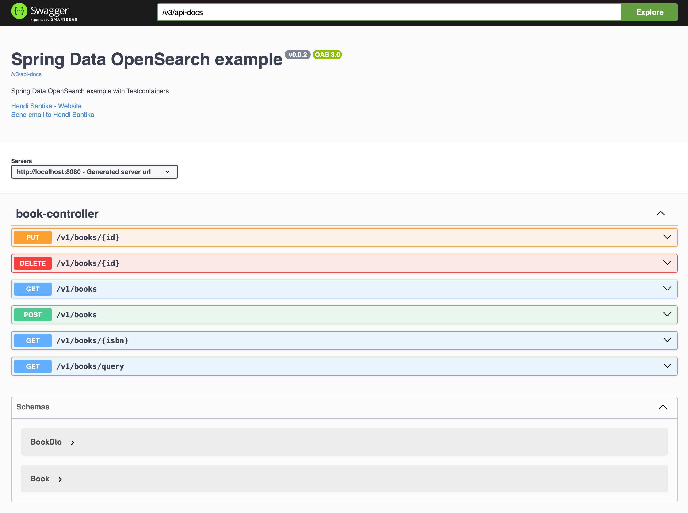

# Spring Data OpenSearch Example with Spring Boot 3 and OpenSearch 2.15

### Introduction

This example demonstrates how to use Spring Data OpenSearch to do simple CRUD operations.

**Technology Stack:**

- Spring Boot 3.5.6
- Java 21
- OpenSearch 2.15.0
- Spring Data OpenSearch 2.0.2
- Lombok 1.18.40
- Testcontainers 1.21.3

This example was inspired by
the [Spring-Data-ElasticSearch-Example](https://github.com/kasramp/Spring-Data-ElasticSearch-Example/tree/master)

You can find the tutorial about this example at this
link: [Getting started with Spring Data OpenSearch](https://medium.com/level-up-roadmap/getting-started-with-spring-boot-data-opensearch-3acde70492a8)

For this example, we created a Book controller that allows doing the following operations with OpenSearch:

* Get the list of all books
* Create a book
* Update a book by Id
* Delete a book by Id
* Search for a book by ISBN
* Fuzzy search for books by author and title

### How to run

The first thing to do is to start OpenSearch. For that, you can use the `docker-compose` file in the develop-scripts
directory and run it like this:

```shell
$ docker-compose -f develop-scripts/docker-compose.yml up -d
```

This will:

- Build a custom OpenSearch image with the `analysis-phonetic` plugin
- Start OpenSearch on port 9200 (and 9600 for monitoring)
- Start OpenSearch Dashboards on port 5601

Wait a few seconds for OpenSearch to fully initialize, then run the application:

```shell
$ ./mvnw clean spring-boot:run
```

Once everything is up and running, open your browser and go to http://localhost:8080. You should see Swagger UI to
interact
with.

**Note:** If you encounter Lombok-related compilation errors, the pom.xml has been configured with explicit annotation
processor paths to resolve this issue with Java 21.

### Run Testcontainers tests

The integration tests are written relying on Testcontainers to spin up OpenSearch on the spot and run tests against it.

To run the integration test (using Testcontainers) just run the below command:

```shell
$ mvn clean verify
```

Make sure you have your docker running.

### Swagger UI

Swagger UI


